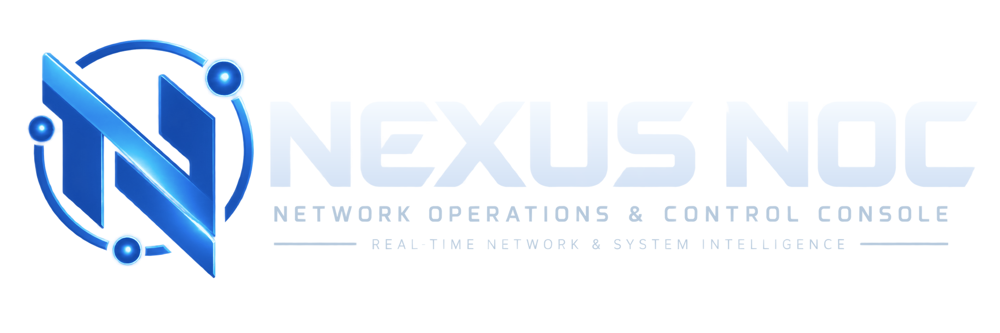
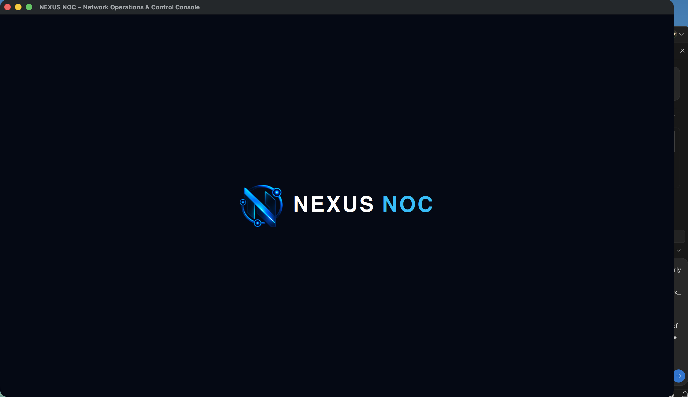
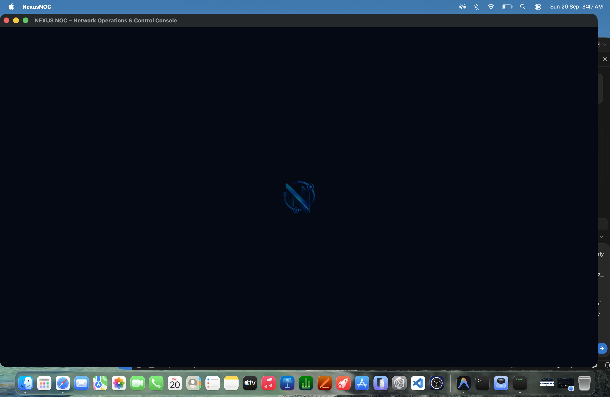
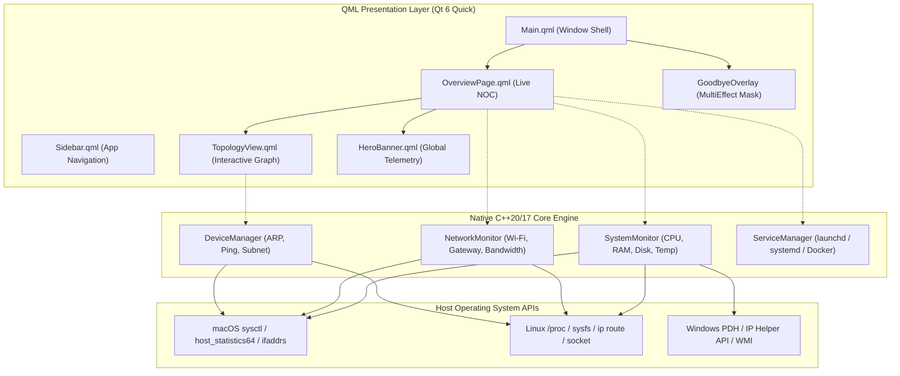

# Nexus NOC - Network Operations & Control Console

<div align="center">



### Production-Grade Network Operations & Infrastructure Intelligence Console

[](https://www.qt.io/)
[](https://isocpp.org/)
[](CMakeLists.txt)
[](.github/workflows/build-macos.yml)
[](.github/workflows/build-ubuntu.yml)
[](.github/workflows/build-windows.yml)
[](https://github.com/skrehanahamed/Nexus_NOC/releases)
[](https://github.com/skrehanahamed)
[](LICENSE)

<br/>

<sub>Made by <b>Sk Rehan Ahamed</b> with the help of <b>Antigravity</b> and <b>ChatGPT</b></sub>

<br/><br/>

[](https://github.com/skrehanahamed/Nexus_NOC)

*Real-Time Operations & Control Console displaying live network telemetry, hardware resources, gateway diagnostics, and interactive topology map.*

</div>

---

## Executive Overview

**Nexus NOC** is a modern, production-grade Network Operations Center (NOC) and system monitoring appliance designed with **Qt 6 (QML / Qt Quick)** and modern **C++17**. Engineered as an all-in-one local intelligence hub for system administrators, DevOps engineers, and makers, the console delivers hardware-accelerated 60 FPS real-time telemetry, automated subnet device discovery (ARP/Ping scanning), Docker daemon orchestration, system daemon telemetry (`launchd` / `systemd`), dynamic multi-core resource tracking, interactive network topology mapping, and instant security alert streams.

The architecture decouples the GPU-accelerated QML presentation layer from asynchronous, non-blocking C++ backend controllers (`SystemMonitor`, `NetworkMonitor`, `DeviceManager`, `ServiceManager`), establishing an enterprise-ready appliance state machine that operates deterministically across macOS, Linux, and Windows.

---

## Release Notes: September 20, 2026 (v1.0.0)

**Date of Update:** September 20, 2026  
**Release Version:** v1.0.0 (Production Release)

### Key Deliverables and Capabilities in v1.0.0:

1. **Real-Time Network Telemetry & Gateway Diagnostics**
   - Active gateway auto-discovery (`192.168.1.254` / local gateway) and DNS ping latency profiling.
   - Live bidirectional bandwidth metrics (Rx/Tx Mbps) mapped to smooth cubic spline canvas graphs.
   - Dual interface monitoring (Wi-Fi 802.11ax/ac link rate, BSSID, RSSI and high-speed Ethernet).

2. **Dynamic Network Topology Engine**
   - Interactive SVG node graph visualizing the path from Public Internet &rarr; Edge Gateway Router &rarr; Nexus NOC Appliance &rarr; Fan-Out Connected Subnet.
   - Live latency indicators on every hop with hover micro-animations and contextual click-through navigation to subsystem inspector pages.

3. **Subnet Device Discovery (DeviceManager Engine)**
   - Asynchronous ARP table polling and local broadcast ping sweep identifying active network nodes.
   - Dynamic vendor OUI profiling, MAC address classification, host device identification, and active lease tracking.

4. **Microservices & Container Orchestration (Docker & Daemons)**
   - Local Docker daemon connectivity check (`docker.sock`) tracking running containers, memory utilization, and container images.
   - Operating system service daemon inspection (`launchd` on macOS, `systemd` on Linux) showing live service states, PID tracking, and restart capabilities.

5. **Multi-Core Resource Telemetry (SystemMonitor Engine)**
   - Asynchronous multi-core CPU percentage load calculation, RAM allocation breakdown (Active, Wired, Compressed, Free), disk I/O metrics, and core temperature sensors.
   - SVG circular gauges with dynamic color interpolation from emerald green (optimal) to cyan and amber warning levels.

6. **Cinematic Hardware Boot & Shutdown Sequence**
   - **Startup Sequence:** Minimal cold boot brand reveal featuring the Nexus NOC emblem and left-to-right typography reveal.
   - **Shutdown Sequence:** Graceful power-down sequence with a slow, cinematic light beam sweep masked strictly to the logo emblem silhouette (zero square bounding box artifacts) over a deep obsidian backdrop.

---

## Visual Showcase and Subsystem Tour

<div align="center">

### 1. Unified Operations Console & Real-Time Topology

*Unified Operations Console featuring real-time bandwidth spline graphs, multi-core system gauges, live internet latency tracking, and interactive network topology routing.*

<br/>

### 2. Graceful Hardware Shutdown (Slow Logo-Masked Shine)

*Cinema-grade hardware power-down animation displaying a slow, luminous light sweep constrained strictly to the emblem silhouette without square bounding borders.*

<br/>

### 3. Cold Boot Brand Reveal

*Minimal, high-contrast appliance startup sequence with left-to-right name reveal.*

</div>

---

## System Architecture

Nexus NOC is structured into decoupled layers, separating presentation from operating system telemetry:



---

## Downloads & Pre-Built Releases

Official standalone production packages are automatically built and verified for macOS, Linux, and Windows via GitHub Actions:

| Platform | Package Archive | Architecture | Status |
| :--- | :--- | :--- | :--- |
|  **macOS** | [`NexusNOC-v1.0.0-macOS.zip`](https://github.com/skrehanahamed/Nexus_NOC/releases) | Universal (Apple Silicon M-Series & Intel x86_64) | [](.github/workflows/build-macos.yml) |
| 🐧 **Ubuntu / Linux** | [`NexusNOC-v1.0.0-Ubuntu-x86_64.tar.gz`](https://github.com/skrehanahamed/Nexus_NOC/releases) | Linux x86_64 (Ubuntu 22.04 / 24.04+) | [](.github/workflows/build-ubuntu.yml) |
| 🪟 **Windows** | [`NexusNOC-v1.0.0-Windows-x64.zip`](https://github.com/skrehanahamed/Nexus_NOC/releases) | Windows x64 (MSVC 2019 / 2022 Runtime) | [](.github/workflows/build-windows.yml) |

> [!TIP]
> Visit the [**GitHub Releases Page**](https://github.com/skrehanahamed/Nexus_NOC/releases) to download the latest builds, view checksums, and check release notes.

---

## Building from Source

### Prerequisites
- **CMake** (v3.20 or newer)
- **C++17 Compiler** (Clang 15+, GCC 11+, or MSVC 2019+)
- **Qt 6** (6.5 or newer with `Core`, `Gui`, `Quick`, `QuickControls2`, `QuickEffects`)
- **Ninja** build tool (recommended)

### macOS (Homebrew)
```bash
# 1. Install prerequisites via Homebrew
brew install qt cmake ninja

# 2. Clone repository
git clone https://github.com/skrehanahamed/Nexus_NOC.git
cd Nexus_NOC

# 3. Configure and compile
cmake -B build -G Ninja \
  -DCMAKE_BUILD_TYPE=Release \
  -DCMAKE_PREFIX_PATH="$(brew --prefix qt)"

cmake --build build --config Release

# 4. Run Nexus NOC
./build/bin/NexusNOC
```

### Ubuntu / Debian Linux
```bash
# 1. Install Qt 6 and development packages
sudo apt update
sudo apt install -y build-essential cmake ninja-build \
  qt6-base-dev qt6-declarative-dev qt6-declarative-dev-tools \
  qml6-module-qtquick qml6-module-qtquick-controls \
  qml6-module-qtquick-layouts qml6-module-qtquick-effects

# 2. Clone repository
git clone https://github.com/skrehanahamed/Nexus_NOC.git
cd Nexus_NOC

# 3. Configure and compile
cmake -B build -G Ninja -DCMAKE_BUILD_TYPE=Release
cmake --build build --config Release

# 4. Run Nexus NOC
./build/bin/NexusNOC
```

### Windows (MSVC)
```powershell
# 1. Open Visual Studio Developer Command Prompt
# 2. Clone and navigate to repository
git clone https://github.com/skrehanahamed/Nexus_NOC.git
cd Nexus_NOC

# 3. Configure with Qt 6 path and compile
cmake -B build -G Ninja `
  -DCMAKE_BUILD_TYPE=Release `
  -DCMAKE_PREFIX_PATH="C:/Qt/6.6.2/msvc2019_64"

cmake --build build --config Release

# 4. Deploy Qt runtime dependencies and launch
windeployqt --qmldir qml build\bin\NexusNOC.exe
.\build\bin\NexusNOC.exe
```

---

## Technical Specifications

| Dimension | Specification |
| :--- | :--- |
| **Framework** | Qt 6.5+ (Qt Quick / QML / QtQuick.Effects) |
| **Language** | Modern C++17 / C++20 |
| **Target OS** | macOS (Apple Silicon & Intel), Ubuntu 22.04/24.04, Windows 11/10 |
| **GUI Resolution** | 1440 &times; 820 minimum, responsive HiDPI / Retina native |
| **Frame Rate** | 60 FPS hardware-accelerated RHI (Metal / Vulkan / Direct3D 11) |
| **Telemetry Refresh** | Bandwidth (1000ms), Latency (2000ms), System Load (1500ms) |
| **Architecture** | Model-View-Controller (MVC) with decoupled QML context properties |

---

## License

This project is distributed under the terms of the **MIT License**. See [LICENSE](LICENSE) for full legal text.

---

## Author & Acknowledgements

- **Developer:** [Sk Rehan Ahamed](https://github.com/skrehanahamed)
- **Design & Architecture:** Developed with the pairing assistance of **Antigravity** and **ChatGPT**.
